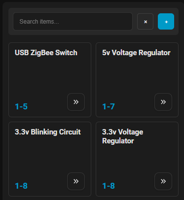

# Simple Inventory Card

[](https://github.com/hacs/integration)

To use, install the [Simple Inventory](https://github.com/blaineventurine/simple_inventory) integration first.

[](https://my.home-assistant.io/redirect/hacs_repository/?owner=blaineventurine&repository=simple-inventory-card-custom&category=Dashboard)

This card allows you to track various items in different inventories, and automatically add an item to a specific to-do list when it is below a certain threshold.


You can set an expiration date for an item, how far ahead you want to be warned, a par level that will update a given todo list:


(the description will not sync with the built-in Home Assistant `todo.shopping_list`, but any other list you create will work)

## Card Types

This repository currently exposes three Lovelace card types:

- `custom:simple-inventory-card-custom`
  The standard card with full item controls.
- `custom:simple-inventory-card-custom-minimal`
  A reduced version of the card with the minimal search/add experience.
- `custom:simple-inventory-card-custom-minimal-grid`
  A minimal grid layout that keeps the compact search bar and renders items as tiles.

## Minimal Grid Card

The minimal grid card is intended for dense browsing on mobile and tablet layouts.

Behavior:

- Uses the same minimal search controls as the minimal card
- Displays items in a responsive grid
- Keeps sort ordering, including natural location sorting such as `1-3`, `2-6`, `11-3`
- Shows the item description under the title when present
- Shows the item location in the bottom-left of the tile
- Uses a chevron button to reveal edit and delete actions above it

Example:

```yaml
type: custom:simple-inventory-card-custom-minimal-grid
entity: sensor.office_parts_inventory
sort_method: location
```

## Notes

- The grid card removes the inventory title/header to maximize visible item space.
- On standard phone portrait layouts, the grid targets two columns by default.
- Because the built artifact in `dist/` is tracked in this repository, run `npm run build` before committing so the bundled file matches `src/`.

